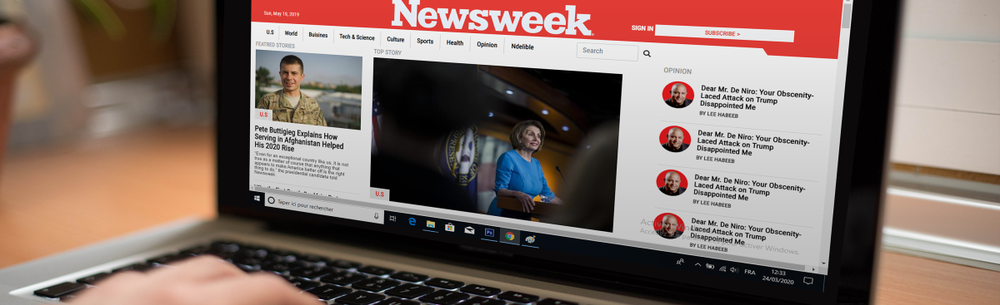

# PROJECT: Responsive Design and CSS Frameworks

## NewsWeek Page clone.

 This project is a clone Newsweek.com page, built using HTML and Bootstrap CSS framework.
 Also CSS media queries hase been used to make this page responsive for several devices, laptops, tablets and phones screens.

> This project is part of a series of projects to be completed by students of [Microverse](https://www.microverse.org/ 'The Global School for Remote Software Developers!').

## Live Demo

[Live Demo Link](https://othman-19.github.io/Bootstrap-responsive-design/) .

## Built With

- HTML
- CSS
- Bootstrap

## Deployed To

- GitHub Pages.

To get a local copy up and running follow these simple example steps.

### Prerequisites

1. Git.
2. Code editor.
3. browser.

## How to run this page

1. Open the terminal.

2. Enter `git clone https://github.com/othman-19/Bootstrap-responsive-design`.

3. Navigate to the cloned repository.

4. In the terminal cd into Bootstrap-responsive-design.

5. Run `code .` in your terminal to see Html and Css code.

6. Open index.html to see the page.

7. Use developer tools in your browser to see the page for diffrent devices.

## Author(s)

1. [Othamane Naamani](https://github.com/othman-19/).

## Contact(s)
[Othmane Namani](https://github.com/othman-19/).  
[Email: othmanenaamani@gmail.com](mailto:othmanenaamani@gmail.com).  
[Portfolio](https://othman-19.github.io/my_portfolio/).  
[LinkedIn](https://www.linkedin.com/in/othman-namani/).  
[twitter](https://twitter.com/ONaamani).  
[DEV Community](https://dev.to/othman).  
[Angel List](https://angel.co/othmane-namani).  

## 🤝 Contributing

Contributions, issues and feature requests are welcome!

Feel free to check the [issues page](issues/).

## Show your support

Give a ⭐️ if you like this project!
